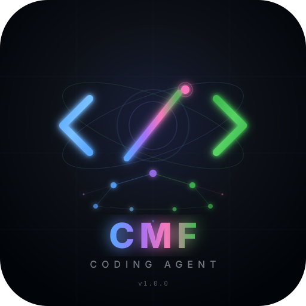
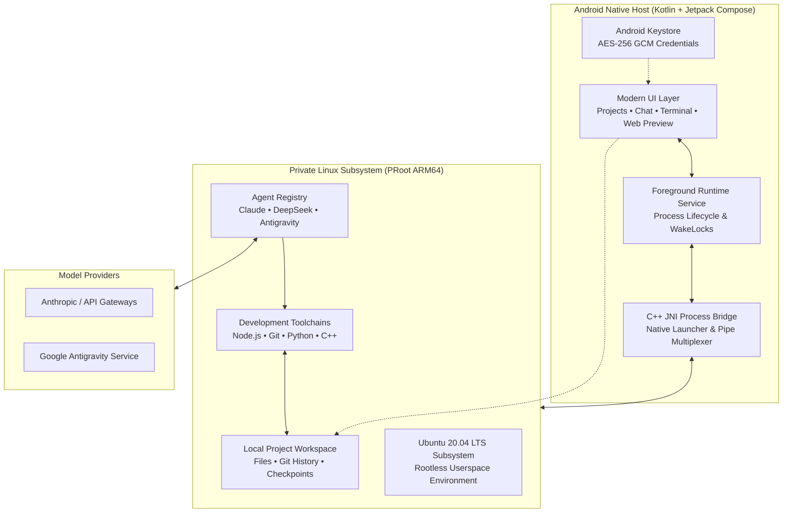

<div align="center">

  

  # Mobile CMF Coding Agent

  ### *AI-powered mobile coding workspace*

  **Chat with coding agents, edit projects, execute real Linux commands, and preview live web servers — all directly on your phone.**

  <br />

  [](#system-requirements)
  [](#system-requirements)
  [](LICENSE)
  [](https://github.com/sufiyan-sabeel/Cmf-ai-coding-agent/releases/latest)

</div>

<br />

---

> [!IMPORTANT]
> **Environment Security Notice**
> CMF Coding Agent runs on **ARM64 Android devices** using a private userspace PRoot layer. While isolated from other apps via standard Android sandbox permissions, PRoot is not a virtualization boundary or hardened security jail. Only execute projects and dependencies you own or trust.

<br />

## Overview

Mobile CMF Coding Agent is a mobile AI-powered development workspace that brings desktop-class software development to your Android phone. It combines a modern Jetpack Compose UI with a self-contained Ubuntu 20.04 LTS subsystem, giving you a full coding environment without requiring root access, unlocked bootloaders, or external applications.

CMF Coding Agent is a modified and derivative work based on the upstream [Mobile Harness](https://github.com/techjarves/Mobile-Harness) open-source project.

<br />

## Download

Choose the edition that fits your setup. Both editions contain the complete app and support secure in-app updates.

| | Edition | Size | Description |
| :---: | :--- | :---: | :--- |
| ⬇️ | **[Online Edition](https://github.com/sufiyan-sabeel/Cmf-ai-coding-agent/releases/latest)** | ~43 MB | **Recommended.** Start with the smaller APK. Runtime bundles are downloaded on first launch. |
| ⬇️ | **[Offline Edition](https://github.com/sufiyan-sabeel/Cmf-ai-coding-agent/releases/latest)** | ~806 MB | Everything included. For devices with limited or unavailable internet. |

> [!TIP]
> **New to CMF Coding Agent?** Start with the **Online Edition**. It's smaller and will automatically download what it needs during setup.

<br />

## Features

<table>
  <tr>
    <td width="50%" valign="top">
      <h3>Autonomous Agent Coding</h3>
      <p>Native integrations with Claude Code, DeepSeek Harness, and Antigravity CLI. Each agent has an isolated driver, settings, and resumable project conversations.</p>
    </td>
    <td width="50%" valign="top">
      <h3>Isolated Linux Subsystem</h3>
      <p>A full Ubuntu 20.04 ARM64 userspace running inside PRoot. Includes Node.js, npm, Git, OpenSSL, and essential shell tooling out of the box.</p>
    </td>
  </tr>
  <tr>
    <td width="50%" valign="top">
      <h3>Instant Web Preview</h3>
      <p>Spin up a Vite, Next.js, or Express server and test web interfaces in real-time within a sandboxed mobile WebView with console telemetry.</p>
    </td>
    <td width="50%" valign="top">
      <h3>Keystore-Grade Encryption</h3>
      <p>API keys and credentials are encrypted using Android Keystore-backed AES-256 GCM. No telemetry, no remote proxies, and zero plain-text leaks.</p>
    </td>
  </tr>
  <tr>
    <td width="50%" valign="top">
      <h3>Persistent Project Sessions</h3>
      <p>Keep projects, chat history, files, and task context together so work can continue across app sessions.</p>
    </td>
    <td width="50%" valign="top">
      <h3>Native File Workflow</h3>
      <p>Browse, edit, search, and attach files directly from the app interface. Interoperate with system storage via Android Storage Access Framework (SAF).</p>
    </td>
  </tr>
  <tr>
    <td width="50%" valign="top">
      <h3>On-device Android Builds</h3>
      <p>Build, install, and launch Android APKs directly on the phone without USB or wireless ADB pairing.</p>
    </td>
    <td width="50%" valign="top">
      <h3>Optional Toolchains</h3>
      <p>Add Python, Android, C/C++, and PHP tooling only when a project needs it.</p>
    </td>
  </tr>
</table>

<br />

## Why CMF

CMF Coding Agent was created to provide developers with a serious, uncompromised mobile coding environment. It is designed for developers who want to build, test, and iterate on projects directly from their Android device — without being tied to a desktop.

Key differentiators:

- **No root required** — runs entirely in user space
- **Full Linux environment** — not a limited terminal emulator
- **AI-native** — built-in support for leading coding agents
- **Privacy-first** — all data stays on your device
- **Open source** — MIT licensed, fully transparent

<br />

## System Requirements

| Metric | Minimum Specification | Recommended Specification |
| :--- | :--- | :--- |
| **Operating System** | Android 9.0 (API level 28) | Android 13.0+ (API level 33+) |
| **CPU Architecture** | 64-bit ARM (`arm64-v8a`) | High-performance 8-Core ARM64 |
| **RAM** | 4 GB | 8 GB or more |
| **Free Storage** | 2.5 GB (Online) / 8.0 GB+ (Offline) | 8.0 GB+ (For multi-language toolchains) |
| **Network** | Required for Online edition setup | Not required for Offline edition |

<br />

## Installation

1. Download the latest release APK from [GitHub Releases](https://github.com/sufiyan-sabeel/Cmf-ai-coding-agent/releases/latest)
2. Open the APK on your Android device to install
3. Follow the onboarding wizard to configure your AI provider and toolchains

```text
Target Architecture : ARM64 (arm64-v8a)
Minimum OS Level    : Android 9.0 (API 28)
```

<br />

## Building from Source

### Prerequisites

- **Android Studio**: Ladybug / Hedgehog or newer
- **Android SDK**: API Level 36 (`compileSdk 36`)
- **Java Development Kit**: JDK 17 (Eclipse Temurin or OpenJDK)
- **Android NDK**: `26.1.10909125`
- **CMake**: `3.22.1`

### Clone & Build

```bash
git clone --recurse-submodules https://github.com/sufiyan-sabeel/Cmf-ai-coding-agent.git
cd Cmf-ai-coding-agent

# Build the Online edition (recommended)
./gradlew assembleOnlineRelease

# Build the Offline edition (includes all runtime bundles)
./gradlew assembleOfflineRelease

# Deploy directly to a connected test device
adb install -r app/build/outputs/apk/online/release/*.apk
```

### Quality Assurance & Testing

```bash
# Run unit tests
./gradlew testOnlineDebugUnitTest

# Run static analysis linter
./gradlew lintOnlineDebug
```

<br />

## AI Coding Workflow

1. **Setup** — Launch the app and follow the guided onboarding wizard to configure device compatibility, select toolchains, and connect your AI provider.
2. **Create** — Start a new project or import an existing one.
3. **Chat** — Describe what you want to build in the AI workspace. The coding agent inspects files, drafts code, and runs builds.
4. **Review** — Examine changes in the diff viewer before accepting them.
5. **Preview** — Test web interfaces in real-time with the built-in WebView.
6. **Build** — Compile and install Android apps directly on your phone.

### Supported AI Providers

| Provider | Integration Type | Status |
| :--- | :---: | :---: |
| **Anthropic API** | Direct Key | Recommended |
| **OpenRouter** | Gateway | Supported |
| **DeepSeek** | Direct Key | Supported |
| **Kimi** | Direct Key | Supported |
| **Custom API** | Endpoint Override | Experimental |

<br />

## Architecture

CMF Coding Agent bridges native Android Jetpack Compose to an isolated PRoot Linux execution layer via an optimized C++ JNI bridge:



### Core Runtime Components

- **Base Environment**: Ubuntu 20.04 ARM64 verified rootfs
- **Agent Engine**: Registry-selected, isolated drivers for Claude Code, DeepSeek Harness, and the official Antigravity CLI
- **Native Tooling**: Node.js LTS, npm, Git, OpenSSL, curl, and GNU coreutils
- **Process Virtualization**: PRoot user-space architecture emulation with zero kernel modifications

<br />

## Security

- **Zero Cloud Intermediaries**: CMF Coding Agent connects your device directly to your chosen AI endpoint. No intermediate relays or telemetry servers collect your prompts or code.
- **Scoped Storage**: Project imports and exports utilize Android's official Storage Access Framework (SAF).
- **Cryptographic Checksums**: Root filesystem archives and CLI packages are verified via SHA-256 checksums prior to extraction.
- **Encrypted Secrets**: API tokens are encrypted in hardware-backed storage via Android Keystore.

<br />

## Storage

CMF Coding Agent uses app-private Android storage for all project data, runtime files, and conversation history. The base runtime requires approximately 2.5 GB of free storage. Optional toolchains (Python, Android, C/C++, PHP) consume additional space.

<br />

## CI/CD

This project uses GitHub Actions for automated builds and releases:

- **Trigger**: Push a version tag (e.g., `v1.0.0`) to start a release build
- **Builds**: Both Online and Offline APKs are built and verified
- **Release**: APKs are automatically uploaded to GitHub Releases
- **Workflow**: [`.github/workflows/release.yml`](.github/workflows/release.yml)

To create a new release:

```bash
git tag -a v1.1.0 -m "v1.1.0: Description"
git push origin v1.1.0
```

<br />

## Screenshots

*Screenshots coming soon.*

<br />

## Roadmap

- Enhanced terminal emulation
- Additional AI provider integrations
- Plugin system for custom toolchains
- Cloud sync (opt-in)
- Improved file editing experience
- Performance optimizations

<br />

## Creator

**Umaiz Sufiyan**

- GitHub: [https://github.com/sufiyan-sabeel](https://github.com/sufiyan-sabeel)
- Instagram: [https://instagram.com/umaizsufiyan.78](https://instagram.com/umaizsufiyan.78)

<br />

## Open Source & Acknowledgements

CMF Coding Agent is a modified and derivative work based on the [Mobile Harness](https://github.com/techjarves/Mobile-Harness) project by Tech Jarves, licensed under the MIT License.

This application incorporates upstream open-source components and third-party software including:

- **Ubuntu 20.04 LTS** — Canonical Ltd.
- **Node.js** — OpenJS Foundation
- **Claude Code** — Anthropic, PBC
- **DeepSeek Harness** — DeepSeek
- **Antigravity CLI** — Google
- **Jetpack Compose** — Google
- **PRoot** — PRoot contributors
- **talloc** — Andrew Tridgell

Third-party open-source licenses are compiled in [`app/src/main/assets/licenses`](app/src/main/assets/licenses).

<br />

## License

This project is licensed under the [MIT License](LICENSE). Third-party runtime binaries and packages remain governed by their respective upstream licenses.

<br />

---

<div align="center">
  <sub>Built for developers who want a serious development environment wherever they go.</sub>
  <br />
  <sub>Copyright © 2026 Umaiz Sufiyan. Based on upstream open-source software.</sub>
</div>
