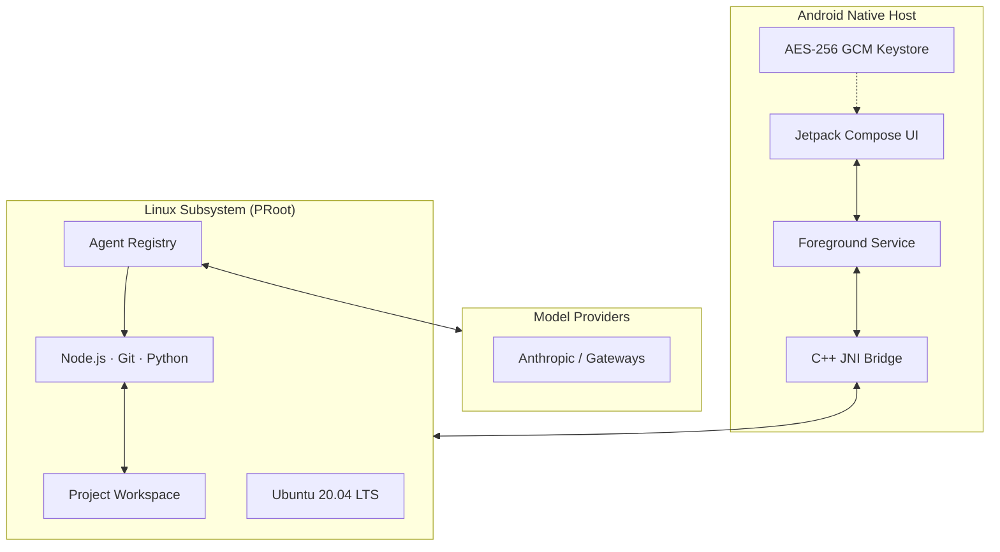

<div align="center">

  

  ---

  [](#system-requirements)
  [](#system-requirements)
  [](LICENSE)
  [](https://github.com/sufiyan-sabeel/Cmf-ai-coding-agent/releases/latest)

  **Chat with coding agents, edit projects, execute real Linux commands, and preview live web servers — all directly on your phone.**

</div>

<br />

---

> [!IMPORTANT]
> **Environment Security Notice**
> CMF Coding Agent runs on **ARM64 Android devices** using a private userspace PRoot layer. While isolated from other apps via standard Android sandbox permissions, PRoot is not a virtualization boundary or hardened security jail. Only execute projects and dependencies you own or trust.

<br />

## Overview

Mobile CMF Coding Agent is a mobile AI-powered development workspace that brings desktop-class software development to your Android phone. It combines a modern Jetpack Compose UI with a self-contained Ubuntu 20.04 LTS subsystem, giving you a full coding environment without requiring root access, unlocked bootloaders, or external applications.

CMF Coding Agent is a modified and derivative work based on the upstream [Mobile Harness](https://github.com/techjarves/Mobile-Harness) open-source project.

<br />

## Download

Choose the edition that fits your setup. Both editions contain the complete app and support secure in-app updates.

<table>
  <tr>
    <td align="center" width="50%">
      <h3>⚡ Online Edition</h3>
      <p><strong>~43 MB · Recommended</strong></p>
      <p>Start with the smaller APK. Core, Python, and Android runtime bundles are downloaded only when needed.</p>
      <a href="https://github.com/sufiyan-sabeel/Cmf-ai-coding-agent/releases/latest">
        
      </a>
    </td>
    <td align="center" width="50%">
      <h3>📦 Offline Edition</h3>
      <p><strong>~806 MB · Everything included</strong></p>
      <p>Includes the Core, Python, and Android runtime bundles for setup with limited or unavailable internet.</p>
      <a href="https://github.com/sufiyan-sabeel/Cmf-ai-coding-agent/releases/latest">
        
      </a>
    </td>
  </tr>
</table>

> [!TIP]
> **New to CMF Coding Agent?** Start with the **Online Edition**. It's smaller and will automatically download what it needs during setup.

<br />

## Features

<table>
  <tr>
    <td width="50%" valign="top">
      <h3>🤖 Autonomous Agent Coding</h3>
      <p>Native integrations with Claude Code, DeepSeek Harness, and Antigravity CLI. Each agent has an isolated driver, settings, and resumable project conversations.</p>
    </td>
    <td width="50%" valign="top">
      <h3>🐧 Isolated Linux Subsystem</h3>
      <p>A full Ubuntu 20.04 ARM64 userspace running inside PRoot. Includes Node.js, npm, Git, OpenSSL, and essential shell tooling out of the box.</p>
    </td>
  </tr>
  <tr>
    <td width="50%" valign="top">
      <h3>🌐 Instant Web Preview</h3>
      <p>Spin up a Vite, Next.js, or Express server and test web interfaces in real-time within a sandboxed mobile WebView with console telemetry.</p>
    </td>
    <td width="50%" valign="top">
      <h3>🔐 Keystore-Grade Encryption</h3>
      <p>API keys and credentials are encrypted using Android Keystore-backed AES-256 GCM. No telemetry, no remote proxies, and zero plain-text leaks.</p>
    </td>
  </tr>
  <tr>
    <td width="50%" valign="top">
      <h3>💾 Persistent Project Sessions</h3>
      <p>Keep projects, chat history, files, and task context together so work can continue across app sessions.</p>
    </td>
    <td width="50%" valign="top">
      <h3>📁 Native File Workflow</h3>
      <p>Browse, edit, search, and attach files directly from the app interface. Interoperate with system storage via Android Storage Access Framework (SAF).</p>
    </td>
  </tr>
  <tr>
    <td width="50%" valign="top">
      <h3>📱 On-device Android Builds</h3>
      <p>Build, install, and launch Android APKs directly on the phone without USB or wireless ADB pairing.</p>
    </td>
    <td width="50%" valign="top">
      <h3>🧩 Optional Toolchains</h3>
      <p>Add Python, Android, C/C++, and PHP tooling only when a project needs it.</p>
    </td>
  </tr>
</table>

<br />

## Why CMF

CMF Coding Agent was created to provide developers with a serious, uncompromised mobile coding environment. It is designed for developers who want to build, test, and iterate on projects directly from their Android device — without being tied to a desktop.

| | |
| :--- | :--- |
| **No root required** | Runs entirely in user space |
| **Full Linux environment** | Not a limited terminal emulator |
| **AI-native** | Built-in support for leading coding agents |
| **Privacy-first** | All data stays on your device |
| **Open source** | MIT licensed, fully transparent |

<br />

## System Requirements

| Metric | Minimum | Recommended |
| :--- | :--- | :--- |
| **OS** | Android 9.0 (API 28) | Android 13.0+ (API 33+) |
| **CPU** | ARM64 (`arm64-v8a`) | 8-Core ARM64 |
| **RAM** | 4 GB | 8 GB+ |
| **Storage** | 2.5 GB (Online) / 8 GB+ (Offline) | 8 GB+ |
| **Network** | Required for Online setup | Not required for Offline |

<br />

## Installation

1. Download the APK from [GitHub Releases](https://github.com/sufiyan-sabeel/Cmf-ai-coding-agent/releases/latest)
2. Open the APK on your Android device to install
3. Follow the onboarding wizard to configure your AI provider and toolchains

<br />

## Building from Source

### Prerequisites

- Android Studio (Ladybug / Hedgehog or newer)
- Android SDK: API Level 36 (`compileSdk 36`)
- JDK 17 (Eclipse Temurin or OpenJDK)
- Android NDK: `26.1.10909125`
- CMake: `3.22.1`

### Build

```bash
git clone --recurse-submodules https://github.com/sufiyan-sabeel/Cmf-ai-coding-agent.git
cd Cmf-ai-coding-agent

# Online edition (recommended)
./gradlew assembleOnlineRelease

# Offline edition (includes all runtime bundles)
./gradlew assembleOfflineRelease

# Install on connected device
adb install -r app/build/outputs/apk/online/release/*.apk
```

### Test

```bash
./gradlew testOnlineDebugUnitTest
./gradlew lintOnlineDebug
```

<br />

## AI Coding Workflow

1. **Setup** — Launch the app and follow the guided onboarding wizard
2. **Create** — Start a new project or import an existing one
3. **Chat** — Describe what you want to build in the AI workspace
4. **Review** — Examine changes in the diff viewer before accepting them
5. **Preview** — Test web interfaces in real-time with the built-in WebView
6. **Build** — Compile and install Android apps directly on your phone

### Supported AI Providers

| Provider | Integration | Status |
| :--- | :---: | :---: |
| **Anthropic API** | Direct Key | ✅ Recommended |
| **OpenRouter** | Gateway | ✅ Supported |
| **DeepSeek** | Direct Key | ✅ Supported |
| **Kimi** | Direct Key | ✅ Supported |
| **Custom API** | Endpoint Override | 🧪 Experimental |

<br />

## Architecture



### Core Components

| Component | Description |
| :--- | :--- |
| **Base Environment** | Ubuntu 20.04 ARM64 verified rootfs |
| **Agent Engine** | Isolated drivers for Claude Code, DeepSeek Harness, Antigravity CLI |
| **Native Tooling** | Node.js LTS, npm, Git, OpenSSL, curl, GNU coreutils |
| **Process Virtualization** | PRoot user-space emulation, zero kernel modifications |

<br />

## Security

- **Zero Cloud Intermediaries** — Direct connection to your AI endpoint
- **Scoped Storage** — Android Storage Access Framework (SAF)
- **Cryptographic Checksums** — SHA-256 verification before extraction
- **Encrypted Secrets** — Hardware-backed Android Keystore

<br />

## CI/CD

This project uses GitHub Actions for automated builds and releases.

**Workflow:** [`.github/workflows/release.yml`](.github/workflows/release.yml)

To create a new release:

```bash
git tag -a v1.1.0 -m "v1.1.0: Description"
git push origin v1.1.0
```

Both Online and Offline APKs are built, verified, and uploaded to GitHub Releases automatically.

<br />

## Roadmap

- [ ] Enhanced terminal emulation
- [ ] Additional AI provider integrations
- [ ] Plugin system for custom toolchains
- [ ] Cloud sync (opt-in)
- [ ] Improved file editing experience
- [ ] Performance optimizations

<br />

## Creator

**Umaiz Sufiyan**

<a href="https://github.com/sufiyan-sabeel">
  
</a>
<a href="https://instagram.com/umaizsufiyan.78">
  
</a>

<br />

## Open Source & Acknowledgements

CMF Coding Agent is a modified and derivative work based on the [Mobile Harness](https://github.com/techjarves/Mobile-Harness) project by Tech Jarves, licensed under the MIT License.

This application incorporates upstream open-source components including:

| Component | Maintainer |
| :--- | :--- |
| **Ubuntu 20.04 LTS** | Canonical Ltd. |
| **Node.js** | OpenJS Foundation |
| **Claude Code** | Anthropic, PBC |
| **DeepSeek Harness** | DeepSeek |
| **Antigravity CLI** | Google |
| **Jetpack Compose** | Google |
| **PRoot** | PRoot contributors |
| **talloc** | Andrew Tridgell |

Third-party licenses: [`app/src/main/assets/licenses`](app/src/main/assets/licenses)

<br />

## License

This project is licensed under the [MIT License](LICENSE). Third-party runtime binaries and packages remain governed by their respective upstream licenses.

<br />

---

<div align="center">
  
  <br /><br />
  <sub>Built for developers who want a serious development environment wherever they go.</sub>
  <br />
  <sub>Copyright © 2026 Umaiz Sufiyan. Based on upstream open-source software.</sub>
</div>
